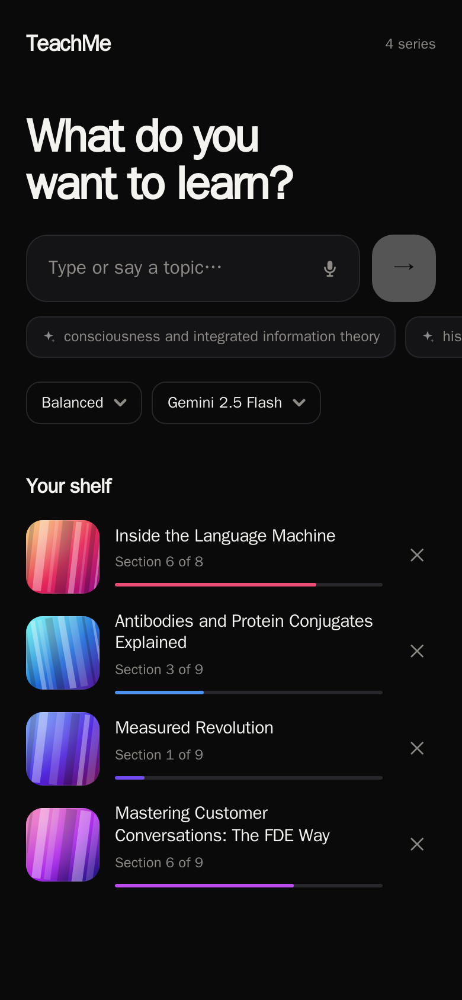
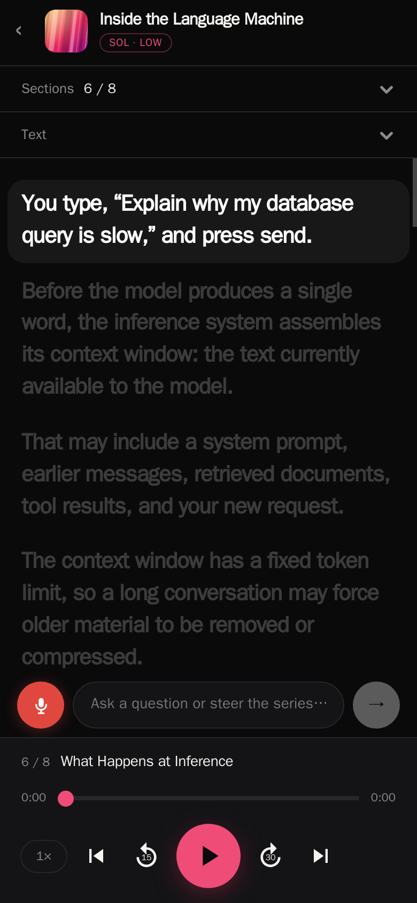

# TeachMe

[](https://github.com/jdmnk/teachme/actions/workflows/ci.yml) [](LICENSE)

<p align="center">
  
  &nbsp;
  
</p>

Say a topic, start listening. TeachMe turns anything you want to learn into a
spoken audio series you can play on the go — skip sections like songs, ask
questions or steer the direction mid-listen (typed or by voice), and pick up
where you left off.

TeachMe is **self-hosted and single-user by design**: you deploy your own
instance with your own API keys, protected by one access code. There are no
accounts, no telemetry, and your data is a JSON file plus mp3s on a volume.

## How it works

- **Outline first**: a topic becomes a 6–9 section series plan in one fast LLM
  call (Gemini Flash via OpenRouter by default), so the thread appears within
  seconds.
- **Lazy sections**: each section's ~3-minute script is written on demand and
  synthesized with Azure Speech; the next section is always prefetched, so
  pressing Next is instant in normal listening flow.
- **Steering**: an instruction (or question) replans the remaining sections
  from your current position; already-heard sections stay fixed.
- **Player**: Media Session API wired up — lock-screen and headphone
  next/prev/seek work like a podcast app. Position is saved continuously.
  Azure's word-boundary events drive follow-along sentence highlighting and
  tap-to-seek in the transcript.
- **Storage**: single-user JSON store + mp3 files on a docker volume. One
  shared access code gates everything (the app fronts paid API keys).

## Stack

npm workspaces: `server/` (Express, tsx runtime, no build step) and `web/`
(Vite + React). Mobile-first UI, desktop-friendly; installable as a PWA.

## What you need

| Service | For | Cost |
| --- | --- | --- |
| [OpenRouter](https://openrouter.ai/keys) key | writing outlines & scripts | well under $0.01 per series on the default Gemini Flash |
| [Azure Speech](https://portal.azure.com) resource | text-to-speech | free F0 tier ≈ 0.5M chars/month ≈ 20 series; paid ≈ $0.40 per 9-section series |

Azure Speech is required rather than a simpler TTS because its word-boundary
timing events power the follow-along transcript. A whole series therefore
costs roughly **$0.00–0.40** depending on your Azure tier.

## Run locally

```sh
cp .env.example .env   # fill in keys + access code
npm ci
npm run build          # builds web/dist
npm start              # serves app + API on 127.0.0.1:3200
```

## Develop

```sh
npm run dev:server            # API with reload on 127.0.0.1:3200
npm run dev --workspace=web   # Vite dev server, proxies /api to :3200
npm run typecheck             # what CI runs
```

## Deploy

```sh
cp .env.example .env   # fill in keys + access code
docker compose up -d --build
```

The container binds to `127.0.0.1:3200` on the host. Put a reverse proxy with
HTTPS in front of it (Caddy, nginx, Traefik) — e.g. with Caddy:

```
teachme.example.com {
    reverse_proxy 127.0.0.1:3200
}
```

Deployment-specific tweaks (a shared proxy docker network, the codex engine
below) belong in a `docker-compose.override.yml`, which docker compose picks
up automatically and git ignores.

### Protecting your instance

Your instance spends your money, so the access code is the whole wall:

- **Use a long random access code** — `openssl rand -base64 24`. The login
  endpoint locks out after 10 failed attempts per 15 minutes, but a guessable
  code is still a guessable code.
- **Always front it with HTTPS**; the session cookie is marked `Secure` when
  the proxy sets `x-forwarded-proto: https`.
- Anyone with the code shares one library and one player position per series —
  it's a personal instance, share it like you'd share a Netflix profile.

## Optional: codex engine

Besides pay-per-token OpenRouter models, TeachMe can generate scripts through
the [codex CLI](https://github.com/openai/codex) — billing a flat Codex
subscription instead of tokens. If a logged-in `codex` binary is on the
server's PATH, the codex models appear in the model picker automatically;
otherwise they're hidden.

For docker, mount the binary and its home (holding the login state) into the
container via `docker-compose.override.yml`:

```yaml
services:
  app:
    environment:
      CODEX_HOME: /codex-home
    volumes:
      - /path/to/codex:/usr/local/bin/codex:ro
      - /home/you/.codex:/codex-home
```

Support for Claude Code and other agent CLIs as engines is planned — the
engine layer is a small dispatch in `server/src/llm.ts`.

## Configuration

All via `.env` (see `.env.example`):

| Variable | Required | Default |
| --- | --- | --- |
| `ACCESS_CODE` | yes | — |
| `OPENROUTER_API_KEY` | yes | — |
| `AZURE_SPEECH_KEY` / `AZURE_SPEECH_REGION` | yes | — |
| `TEACHME_MODEL` | no | `google/gemini-2.5-flash` |
| `TEACHME_VOICE` | no | `en-US-AndrewMultilingualNeural` |
| `TEACHME_APP_URL` | no | unset (OpenRouter app attribution) |
| `HOST` / `PORT` | no | `127.0.0.1` / `3200` |
| `DATA_DIR` | no | `./data` (`/data` in docker) |

## Later

iOS app (the web app is designed mobile-first with that in mind), Claude Code
and other agent CLIs as engines, live web search via an agent harness backend.

## License

MIT
